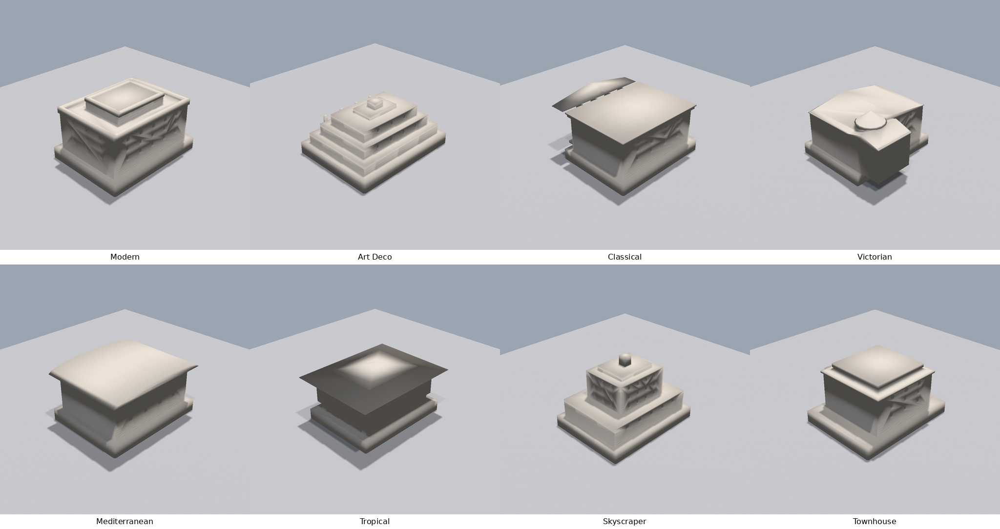

# 3D Hotel Generator

Procedural 3D hotel generator that creates 3D-printable Monopoly-scale hotel game pieces (~1-2cm tall) as STL files. Features 8 distinct architectural styles, a FastAPI backend with manifold3d CSG, and a three.js web preview UI.



## Architectural Styles

| Style | Description |
|-------|-------------|
| **Modern** | Flat roof with parapet, grid windows, cantilever overhang, penthouse box |
| **Art Deco** | Stepped ziggurat massing, vertical fins, geometric crown with spire |
| **Classical** | Columned portico, triangular pediment, entablature, symmetric facade |
| **Victorian** | Asymmetric L-plan, round turret with conical cap, bay windows, dual gabled roofs |
| **Mediterranean** | Barrel (curved) roof, deep eaves, loggia arches, thick stucco walls |
| **Tropical** | Raised on stilts, multi-tier hipped roof with deep overhangs, bracket supports |
| **Skyscraper** | Podium + tower massing, curtain wall grid, decorative crown with spire |
| **Townhouse** | Narrow form, mansard roof, front stoop with steps, projecting bay window |

Each style produces a watertight, manifold solid suitable for FDM or resin 3D printing without supports.

## Quick Start

```bash
# Install
pip install -e ".[dev]"

# Run the API server
uvicorn hotel_generator.api:app --reload

# Open http://localhost:8000 in your browser
```

The web UI lets you select styles, adjust parameters (seed, dimensions, floors), preview the model in 3D, and download STL files.

## Generating STL Files

### Via API

```bash
# Generate STL for a specific style
curl -X POST http://localhost:8000/export/stl \
  -H "Content-Type: application/json" \
  -d '{"style_name": "modern", "seed": 42}' \
  -o hotel_modern.stl
```

### Via Python

```python
from hotel_generator.config import BuildingParams, PrinterProfile
from hotel_generator.assembly.building import HotelBuilder
from hotel_generator.export.stl import export_stl_bytes
from hotel_generator.settings import Settings

builder = HotelBuilder(Settings())
params = BuildingParams(style_name="victorian", seed=42)
result = builder.build(params)
stl_bytes = export_stl_bytes(result.manifold)

with open("hotel_victorian.stl", "wb") as f:
    f.write(stl_bytes)
```

## API Endpoints

| Method | Path | Description |
|--------|------|-------------|
| `POST` | `/generate` | Generate GLB preview (returns binary with `X-Build-Metadata` header) |
| `POST` | `/export/stl` | Generate and download STL file |
| `GET` | `/styles` | List available styles with parameter schemas |
| `GET` | `/health` | Health check |

Request body for generation endpoints:

```json
{
  "style_name": "modern",
  "seed": 42,
  "width": 8.0,
  "depth": 6.0,
  "num_floors": 4,
  "floor_height": 0.8,
  "printer_type": "fdm"
}
```

## Rendering (Headless)

Generate PNG renders without a display using OSMesa:

```bash
# Install render dependencies
pip install -e ".[render]"
sudo apt-get install -y libosmesa6-dev

# Render a single style (4 angles)
PYOPENGL_PLATFORM=osmesa python scripts/render_hotel.py --style modern --seed 42

# Render all 8 styles in a comparison grid
PYOPENGL_PLATFORM=osmesa python scripts/render_style_grid.py
```

## Print Specifications

Designed for Monopoly-scale game pieces:

```
Total height:    10-20mm (including base and roof)
Footprint:       5-10mm x 4-8mm
Base slab:       extends 0.5mm beyond building on each side
Wall thickness:  0.8mm (FDM) / 0.5mm (resin)
```

Every piece includes a base slab with chamfered edges for bed adhesion and stability. The generator supports two printer profiles:

- **FDM** (default) — Thicker walls, square columns, no arched windows, 45-degree overhang limit
- **Resin** — Finer detail, round columns, arched windows, individual balusters

## Project Structure

```
src/hotel_generator/
  geometry/       Pure geometry primitives (box, cylinder, extrude, booleans, transforms)
  components/     Reusable building parts (roof, wall, window, door, column, base, facade)
  styles/         8 architectural style generators (strategy pattern with registry)
  assembly/       Build orchestrator (HotelBuilder -> BuildResult)
  export/         STL and GLB export via trimesh
  validation/     Post-generation quality checks (watertight, size, orientation)
  config.py       Pydantic models (BuildingParams, PrinterProfile, response models)
  api.py          FastAPI server with CORS and static file serving
web/              three.js frontend (no build step, import maps)
scripts/          Rendering, validation gates, and critique utilities
tests/            119 tests across geometry, components, styles, assembly, export, API
```

## Development

```bash
# Install with dev dependencies
pip install -e ".[dev]"

# Run tests
pytest tests/ -x -q

# Validate a specific implementation step
python scripts/validate_step.py --step N
```

## Technology

- **[manifold3d](https://github.com/elalish/manifold)** — CSG geometry engine, guaranteed watertight output
- **[trimesh](https://trimesh.org/)** — Mesh I/O for STL/GLB export
- **[FastAPI](https://fastapi.tiangolo.com/)** — Web API with auto-generated OpenAPI docs
- **[three.js](https://threejs.org/)** — Browser-based 3D preview
- **[Pydantic](https://docs.pydantic.dev/)** — Parameter validation and configuration

## License

MIT
